# C4 Architecture Documentation - ALZ Homepage V6

Diese Dokumentation beschreibt die Softwarearchitektur der ALZ Homepage V6 nach dem C4-Modell.

## Überblick

Die ALZ Homepage V6 ist eine moderne, statisch generierte Website mit Headless-CMS-Architektur, die Notion und Contentful als Content-Quellen nutzt.

---

## Level 1: System Context Diagram

```mermaid
flowchart TB
    subgraph Externe_Systeme["Externe Systeme"]
        Notion["📄 Notion<br/>CMS für News<br/>& Über uns"]
        Contentful["🎨 Contentful<br/>CMS für Team<br/>& Galerie"]
        VercelBlob["💾 Vercel Blob<br/>Bild-Speicherung"]
        Make["⚡ Make.com<br/>Automation"]
    end

    subgraph Nutzer["Nutzer"]
        Besucher["👥 Website Besucher"]
        Admin["👨‍💻 Content Admin<br/>(Notion/Contentful)"]
    end

    subgraph ALZ_System["ALZ Homepage V6"]
        Website["🌐 Website<br/>Next.js 14"]
    end

    Besucher -->|"Besucht"| Website
    Admin -->|"Erstellt Content"| Notion
    Admin -->|"Erstellt Content"| Contentful
    
    Website -->|"API Calls"| Notion
    Website -->|"API Calls"| Contentful
    Website -->|"Bilder laden"| VercelBlob
    
    Make -->|"Webhook Trigger"| Website
    Notion -->|"Änderungen"| Make
```



### Beschreibung

| System | Technologie | Zweck |
|--------|-------------|-------|
| **ALZ Website** | Next.js 14 + React | Hauptanwendung, SSR/SSG |
| **Notion** | Notion API | CMS für News und Über-uns Content |
| **Contentful** | Contentful API | CMS für Team und Galerie |
| **Vercel Blob** | Vercel Storage | Permanente Bild-Speicherung |
| **Make.com** | Automation | Triggert Revalidation bei Notion-Änderungen |

---

## Level 2: Container Diagram

```mermaid
flowchart TB
    subgraph Client["Client Layer"]
        Browser["🌐 Browser<br/>HTML/CSS/JS"]
    end

    subgraph Vercel_Platform["Vercel Edge Network"]
        CDN["📡 Vercel CDN<br/>Static Assets"]
        Functions["⚡ Edge Functions<br/>API Routes"]
    end

    subgraph Application["Application Layer"]
        NextApp["📱 Next.js App<br/>App Router"]
        
        subgraph Pages["Pages"]
            NewsPage["/news<br/>News-Übersicht"]
            NewsDetailPage["/news/[slug]<br/>News-Detail"]
            AboutPage["/ueber-uns<br/>Über uns"]
            TeamPage["/team<br/>Team"]
            GalleryPage["/galerie<br/>Galerie"]
        end
        
        subgraph API_Routes["API Routes"]
            RevalidateAPI["/api/revalidate<br/>Cache Invalidation"]
            MigrateAPI["/api/migrate-images<br/>Bild-Migration"]
        end
    end

    subgraph Data_Layer["Data Layer"]
        NotionClient["📚 Notion Client<br/>@notionhq/client"]
        ContentfulClient["📦 Contentful Client<br/>contentful"]
        BlobStorage["🖼️ Vercel Blob<br/>@vercel/blob"]
    end

    subgraph External["External Services"]
        Notion[("Notion API")]
        Contentful[("Contentful API")]
    end

    Browser -->|"HTTPS Request"| CDN
    CDN -->|"Static/ISR"| NextApp
    CDN -->|"API Calls"| Functions
    
    Functions --> RevalidateAPI
    Functions --> MigrateAPI
    
    NextApp --> NewsPage
    NextApp --> NewsDetailPage
    NextApp --> AboutPage
    NextApp --> TeamPage
    NextApp --> GalleryPage
    
    NewsPage --> NotionClient
    NewsDetailPage --> NotionClient
    AboutPage --> NotionClient
    TeamPage --> ContentfulClient
    GalleryPage --> ContentfulClient
    
    RevalidateAPI --> NextApp
    MigrateAPI --> BlobStorage
    
    NotionClient -->|"REST API"| Notion
    ContentfulClient -->|"GraphQL/REST"| Contentful
```



### Container Beschreibung

| Container | Technologie | Verantwortung |
|-----------|-------------|---------------|
| **Next.js App** | Next.js 14 + React + TypeScript | UI Rendering, Routing, Data Fetching |
| **Notion Client** | @notionhq/client | Kommunikation mit Notion API |
| **Contentful Client** | contentful SDK | Kommunikation mit Contentful API |
| **Vercel Blob** | @vercel/blob | Permanente Bild-Speicherung |
| **API Routes** | Next.js API Routes | Revalidation & Migration Endpoints |
| **Edge Functions** | Vercel Edge | Serverless Functions am Edge |

---

## Level 3: Component Diagram

### 3.1 Content Module


### 3.2 Page Components


### 3.3 API Routes


---

## Level 4: Code Diagram (Beispiele)

### 4.1 Datenfluss: News Laden

```typescript
// Sequenz: NewsPage → getNews → Notion API → Rendering

// 1. Server Component
async function NewsPage() {
  const news = await getNews(20); // ← Server-Side Fetching
  return <NewsList items={news} />;
}

// 2. Data Fetching (lib/notion.ts)
async function getNews(limit = 10) {
  const response = await notionClient.databases.query({
    database_id: NOTION_DATABASE_ID,
    filter: { property: 'Veröffentlicht', checkbox: { equals: true } },
    sorts: [{ property: 'Datum', direction: 'descending' }],
    page_size: limit,
  });
  
  return response.results.map(mapNewsEntry);
}

// 3. Data Mapping
function mapNewsEntry(page) {
  return {
    id: page.id,
    title: extractPlainText(page.properties.Titel?.title),
    slug: generateSlug(title),
    // ... weitere Felder
  };
}

// 4. Rendering (Client Component optional)
function NewsList({ items }) {
  return items.map(item => <NewsCard key={item.id} {...item} />);
}
```

### 4.2 Revalidation Flow


### 4.3 Bild-Migration Flow


---

## Technologie-Stack

### Frontend
- **Framework:** Next.js 14 (App Router)
- **UI Library:** React 18
- **Styling:** Tailwind CSS
- **Components:** shadcn/ui
- **Language:** TypeScript

### Backend/API
- **Runtime:** Node.js 20
- **API:** Next.js API Routes
- **Caching:** Next.js ISR (Incremental Static Regeneration)

### CMS/Content
- **News:** Notion API (@notionhq/client)
- **Team/Galerie:** Contentful SDK
- **Automation:** Make.com (Webhooks)

### Storage
- **Bilder:** Vercel Blob Storage
- **Temporär:** Notion File URLs (1h gültig)

### Deployment
- **Hosting:** Vercel
- **Edge:** Vercel Edge Functions
- **CDN:** Vercel Edge Network

---

## Architektur-Entscheidungen

### 1. Hybrid CMS Ansatz
**Entscheidung:** Notion für News/About, Contentful für Team/Galerie  
**Begründung:** Notion bietet bessere Rich-Text Editierung für lange Artikel, Contentful für strukturierte Daten

### 2. ISR über SSR
**Entscheidung:** Static Site Generation mit ISR (revalidate)  
**Begründung:** Performance + Aktualität ohne Server-Kosten

### 3. Vercel Blob für Bilder
**Entscheidung:** Bilder zu Vercel Blob migrieren statt direkt aus Notion laden  
**Begründung:** Notion URLs laufen nach 1h ab, Vercel Blob URLs sind permanent

### 4. Make.com für Automation
**Entscheidung:** Externer Service für Webhooks statt Notion native Webhooks  
**Begründung:** Notion bietet keine nativen Webhooks für Datenbank-Änderungen

---

## Quellen

- [Next.js Documentation](https://nextjs.org/docs)
- [Notion API Reference](https://developers.notion.com/)
- [Contentful Documentation](https://www.contentful.com/developers/docs/)
- [Vercel Blob Storage](https://vercel.com/docs/storage/vercel-blob)
- [C4 Model](https://c4model.com/)
